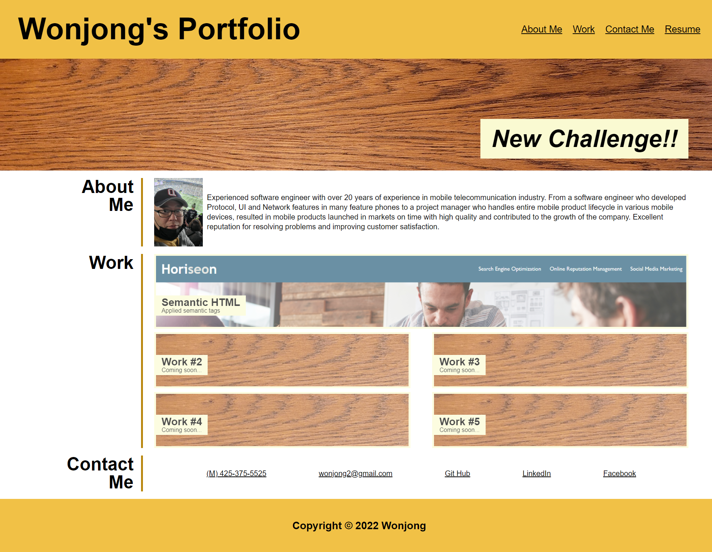
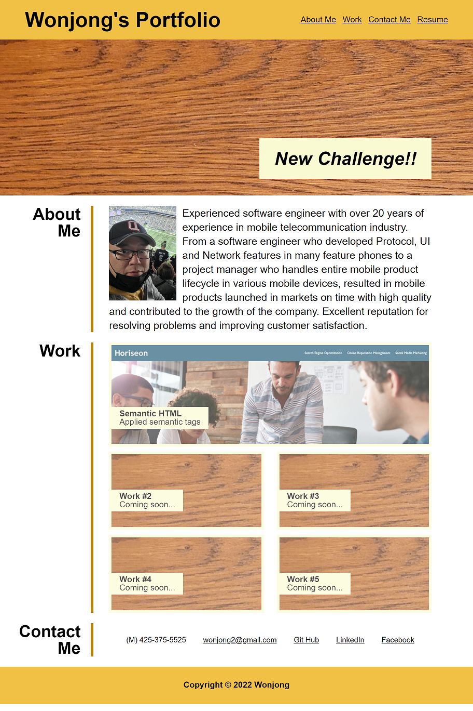
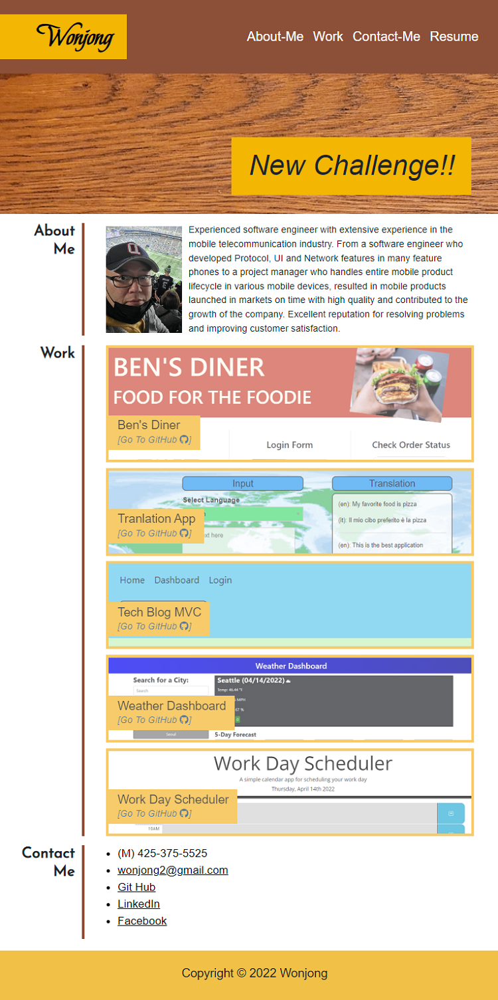
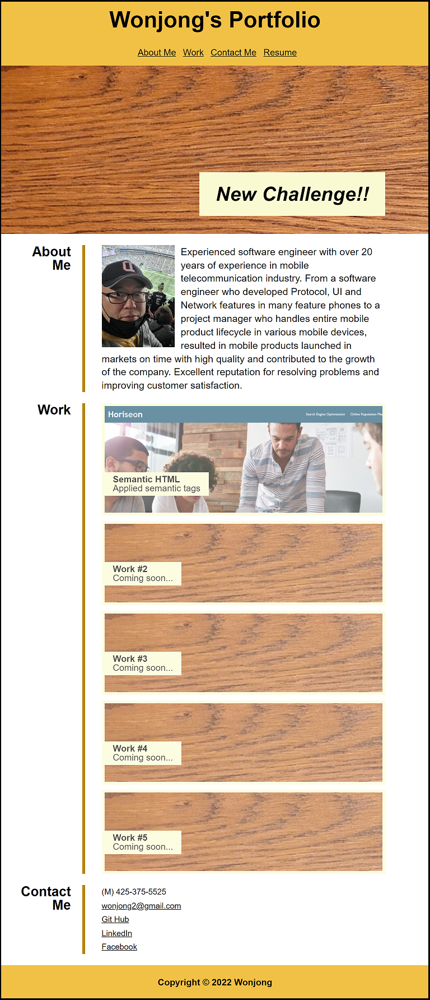
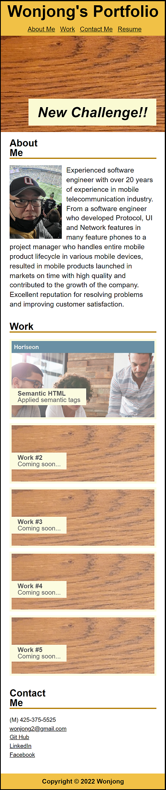

# Wonjong's Portfolio

## Description

This Web-page Provides information about me, Wonjong, such as my introduction, work output, contact info. and a resume.

It will be developed and improved over and over.

- Applied @Media Query for Responsive Web Design
- Applied Flexbox to organize this web page
- Applied Pseudo class to check 'hover' state and change style properly
- Applied CSS variables to handle border/background color efficiently
- Applied 'transition' property to make the effect when the user's mouse moves over the links.

## Web Site's URL

- Wonjong's Portfolio : 
https://wonjong2.github.io/Wonjong_Portfolio/

## Git Hub URL for this Web Site
- wonjong2/Wonjong_Portfolio : https://github.com/wonjong2/Wonjong_Portfolio

## Usage

- When the user clicks one of the links in the navigation, then the UI scrolls to the corresponding section.
- When the user clicks one of the images in the Work section, then user is taken to that deployed application. 

Please see the screenshots of the layout change on this Website.

- Layout 1 (Width > 1063px)  
    

- Layout 2 (1063px >= Width > 820px)  
    <!--  -->
    

- Layout 3 (820px >= Width > 783px)  
     

- Layout 4 (783px >= Width > 540px)  
        

- Layout 5 (540px >= Width)  
        

## License

