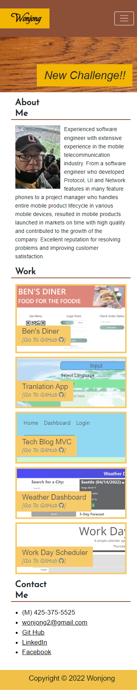

# Wonjong's Portfolio

## Description

This Web-page Provides information about me, Wonjong, such as my introduction, work output, contact info. and a resume.

It will be developed and improved over and over.

< 1st implementation, 3/1 >
- Use @Media Query for Responsive Web Design
- Use Flexbox to organize this web page
- Use Pseudo class to check 'hover' state and change style properly
- Use CSS variables to handle border/background color efficiently
- Use 'transition' property to make the effect when the user's mouse moves over the links.

< 2nd implementation, 4/16 >
- Use Bootstrap for UI configuration
- Use JavaScript to handle 'Click' event on the Work section
- Use Google fonts
- Add the GitHub link to each works
- Use Font Awesome for the GitHub icon
- Update the Resume with the latest information

## Web Site's URL

- Wonjong's Portfolio : 
https://wonjong2.github.io/Wonjong_Portfolio/

## Git Hub URL for this Web Site
- wonjong2/Wonjong_Portfolio : https://github.com/wonjong2/Wonjong_Portfolio

## Usage

- When a user clicks one of the links in the navigation, then the UI scrolls to the corresponding section.
- When a user clicks one of the images in the Work section, then a user is taken to that deployed application. 
- When a user clicks area of "[Go To GitHub]", then a user is taken to the repository of it.
- __Simple Demo__ : https://watch.screencastify.com/v/LhRQBXJ3dNgIPLOZt9Hq

Please see the screenshots of the layout change on this Website.

- Layout 1 (Width >= 1000px)  
    

- Layout 2 (1000px > Width >= 768px)  
     

- Layout 3 (768px > Width )  
     

## License

MIT License

Copyright (c) [2022] [Wonjong Park]

Permission is hereby granted, free of charge, to any person obtaining a copy of this software and associated documentation files (the "Software"), to deal in the Software without restriction, including without limitation the rights to use, copy, modify, merge, publish, distribute, sublicense, and/or sell copies of the Software, and to permit persons to whom the Software is furnished to do so, subject to the following conditions:

The above copyright notice and this permission notice shall be included in all copies or substantial portions of the Software.

THE SOFTWARE IS PROVIDED "AS IS", WITHOUT WARRANTY OF ANY KIND, EXPRESS OR IMPLIED, INCLUDING BUT NOT LIMITED TO THE WARRANTIES OF MERCHANTABILITY, FITNESS FOR A PARTICULAR PURPOSE AND NONINFRINGEMENT. IN NO EVENT SHALL THE AUTHORS OR COPYRIGHT HOLDERS BE LIABLE FOR ANY CLAIM, DAMAGES OR OTHER LIABILITY, WHETHER IN AN ACTION OF CONTRACT, TORT OR OTHERWISE, ARISING FROM, OUT OF OR IN CONNECTION WITH THE SOFTWARE OR THE USE OR OTHER DEALINGS IN THE SOFTWARE.

